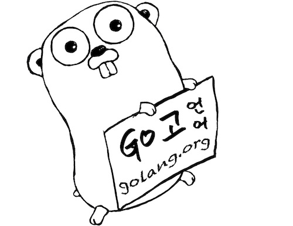

# Go 워크숍

Go 프로그래밍 언어를 짧은 시간내에 효과적으로 익히기 위한 워크숍입니다.

## 워크숍 둘러보기
 * [Go 워크숍](courses/README.md)

## 일정
 * Go 프로그래밍 - (1차 : 12월 예정)
___
모든 자료에 대해서 [Apache License Version 2.0, January 2004](http://www.apache.org/licenses/LICENSE-2.0) 라이센스가 적용됩니다.
