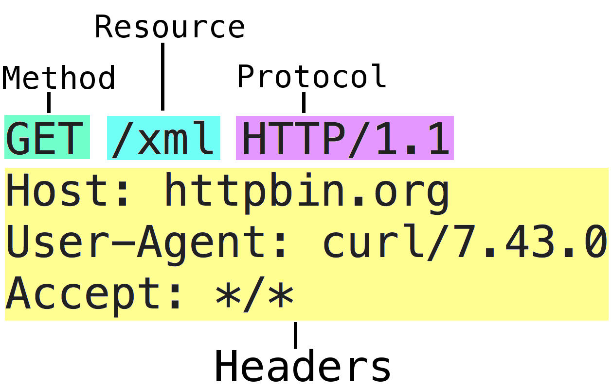
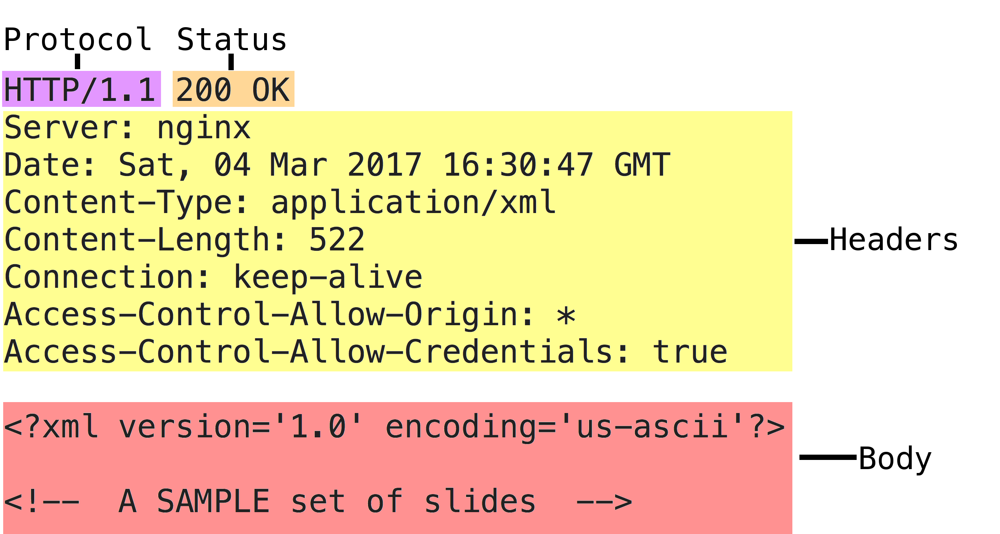

## Web - Basics

web service와 어플리케이션을 만드는데 필요한 기본 지식을 배워봅시다.

## 노트

* 표준 라이브러리에서 service와 app을 만드는데 필요한 많은 것들을 제공하고 있습니다.
* http 패키지는 빌딩 블록을 제공합니다. 바로 익혀야 하는 가장 중요한 타입은 다음과 같습니다.

```go
// A Request represents an HTTP request received by a server
// or to be sent by a client.
//
// Several fields are hidden from this example.
type Request struct {
	Method string
	URL    *url.URL
	Header Header
	Body   io.ReadCloser
}

// A ResponseWriter interface is used by an HTTP handler to
// construct an HTTP response.
type ResponseWriter interface {
	Header() Header
	Write([]byte) (int, error)
	WriteHeader(int)
}

// A Handler responds to an HTTP request.
type Handler interface {
	ServeHTTP(ResponseWriter, *Request)
}

// The HandlerFunc type is an adapter to allow the use of
// ordinary functions as HTTP handlers. If f is a function
// with the appropriate signature, HandlerFunc(f) is a
// Handler that calls f.
type HandlerFunc func(ResponseWriter, *Request)

// ListenAndServe listens on the TCP network address addr
// and then calls Serve with handler to handle requests
// on incoming connections.
func ListenAndServe(addr string, handler Handler) error
```


## 링크

https://golang.org/pkg/net/http/  
https://golang.org/doc/articles/wiki/  

## 코드 리뷰

[Basic Web Handler](example1/main.go)  
[Routing Handlers](example2/main.go)  
[Using the Default Mux](example3/main.go)  
[Making Handlers out of Functions](example4/main.go)  
[Closures as HandlerFuncs](example5/main.go)  
[Servers are already Concurrent](example6/main.go)  

## 노트

An HTTP Request


The Response



## 연습문제

### 연습문제 1

Write a simple web service that has a set of different routes that return the string "Hello World" in multiple languages. Build the service using an Application context (example4) that will own the different handler methods. Then create your own mux (example2), bind the routes and start the service. Validate your routes work in your browser.
___
모든 자료에 대해서 [Apache License Version 2.0, January 2004](http://www.apache.org/licenses/LICENSE-2.0) 라이센스가 적용됩니다.
