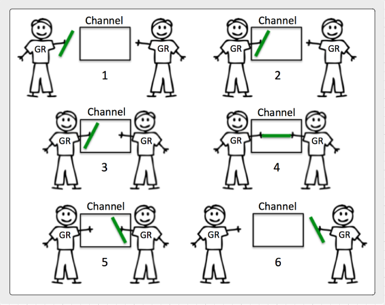

## 채널 (Channels)
채널은 goroutine들이 서로 통신하는 방식으로 시그널링의 개념을 이용합니다. 데이터를 주고/받기를 통하거나 개별 채널에서 상태 변화를 식별하는 방식을 통해서 시그널을 구현합니다. 큐 방식의 채널을 이용해서 소프트웨어를 구성하는 대신 시그널링과 조직을 단순화 시키는데 초점을 맞추야 합니다.   

## 디자인 가이드

* 채널에 대한 [디자인 가이드라인](../../#channel-design)을 참고하세요.

## 다이어그램

### unbuffered channel이 동작하는 방식

### buffered channel이 동작하는 방식

## 링크

[Channel Communication](https://golang.org/ref/mem#tmp_7)  
http://blog.golang.org/share-memory-by-communicating  
http://www.goinggo.net/2014/02/the-nature-of-channels-in-go.html  
[A Retrospective on SEDA](http://matt-welsh.blogspot.com/2010/07/retrospective-on-seda.html) - Matt Welsh  

## Buffer Bloat - 2011

* 버퍼가 크면 채널로 받는 경우 제때 noti 받기가 어렵다.
* They defeat your ability to reduce back pressure in a timely matter.
* 지연 시간이 증가될 수 있다.
* 수신의 연속성을 유지하는 방법으로 buffered channel을 사용한다.
	* 단순히 성능 목적으로 사용하지 않는다.
	* 잘 정의된 큰 데이터를 처리하기 위한 용도로 사용
	* Use them to deal with speed of light issues between handoffs.

[Bufferbloat: Dark Buffers in the Internet](https://www.youtube.com/watch?v=qbIozKVz73g)  
[Buffer Bloat Videos](http://www.bufferbloat.net/projects/cerowrt/wiki/Bloat-videos)  

## 코드 리뷰

[Basic mechanics](example1/example1.go) ([Go Playground](https://play.golang.org/p/264q25rUhi))  
[Tennis game](example2/example2.go) ([Go Playground](https://play.golang.org/p/wlM-cY000f))  
[Relay race](example3/example3.go) ([Go Playground](https://play.golang.org/p/OsyUwckOie))  
[Fan out pattern](example4/example4.go) ([Go Playground](https://play.golang.org/p/kT0F-_fCob))  
[Monitor running time](example5/example5.go) ([Go Playground](https://play.golang.org/p/TsJSagQawy))  

## 고급 코드 리뷰

[Channel 통신 순서](advanced/example1/example1.go) ([Go Playground](https://play.golang.org/p/b3pPHMYZbX))

## 연습문제

### 연습문제 1
2개 goroutine이 10회에 걸쳐서 integer을 주고받는 프로그램을 작성하세요. 각 goroutine이 integer를 수신할 때 화면에 표시하세요. 각 전달에서 integer를 증가시킵니다. 일단 integer가 10이 되면 프로그램을 종료합니다.

[Template](exercises/template1/template1.go) ([Go Playground](https://play.golang.org/p/BUNf38ZLka)) | 
[Answer](exercises/exercise1/exercise1.go) ([Go Playground](https://play.golang.org/p/nCYvfXQwgU))

### 연습문제 2
100개 랜덤 수를 동시에 생성하기 위해서 fan out 패턴을 사용하는 프로그램을 작성하세요. 각 goroutine이 단일 랜덤 수를 생성하고 이 수를 buffered 채널로 main goroutine에 반환합니다. buffer 채널의 크기를 설정해서 매 블록을 전달할 필요없도록 합니다. 필요한 buffer 사이즈만 할당하세요. main goroutine이 각 랜덤 수를 출력하도록 하고 프로그램을 종료합니다.

[Template](exercises/template2/template2.go) ([Go Playground](http://play.golang.org/p/CpsDFNmazH)) | 
[Answer](exercises/exercise2/exercise2.go) ([Go Playground](http://play.golang.org/p/Li7hl3pOSu))
___
모든 자료에 대해서 [Apache License Version 2.0, January 2004](http://www.apache.org/licenses/LICENSE-2.0) 라이센스가 적용됩니다.
