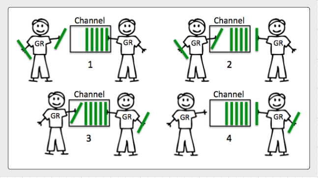

## 채널 (Channels)
채널은 goroutine들이 서로 통신하는 방식으로 시그널링의 개념을 이용합니다. 데이터를 주고/받기를 통하거나 개별 채널에서 상태 변화를 식별하는 방식을 통해서 시그널을 구현합니다. 큐 방식의 채널을 이용해서 소프트웨어를 구성하는 대신 시그널링과 조직을 단순화 시키는데 초점을 맞추야 합니다.   

## 디자인 가이드

* 채널에 대한 [디자인 가이드라인](../../#channel-design)을 참고하세요.

## 다이어그램

### unbuffered channel이 동작하는 방식

### buffered channel이 동작하는 방식

## 링크

[Channel Communication](https://golang.org/ref/mem#tmp_7)  
http://blog.golang.org/share-memory-by-communicating  
http://www.goinggo.net/2014/02/the-nature-of-channels-in-go.html  
[A Retrospective on SEDA](http://matt-welsh.blogspot.com/2010/07/retrospective-on-seda.html) - Matt Welsh  

## Buffer Bloat - 2011

* Large buffers prevent timely notification of back pressure.
* They defeat your ability to reduce back pressure in a timely matter.
* They can increase latency not reduce it.
* Use buffered channels to provide a way of maintaining continuity.
	* Don't use them just for performance.
	* Use them to handle well defined bursts of data.
	* Use them to deal with speed of light issues between handoffs.

[Bufferbloat: Dark Buffers in the Internet](https://www.youtube.com/watch?v=qbIozKVz73g)  
[Buffer Bloat Videos](http://www.bufferbloat.net/projects/cerowrt/wiki/Bloat-videos)  

## 코드 리뷰

[Basic mechanics](example1/example1.go) ([Go Playground](https://play.golang.org/p/264q25rUhi))  
[Tennis game](example2/example2.go) ([Go Playground](https://play.golang.org/p/wlM-cY000f))  
[Relay race](example3/example3.go) ([Go Playground](https://play.golang.org/p/OsyUwckOie))  
[Fan out pattern](example4/example4.go) ([Go Playground](https://play.golang.org/p/kT0F-_fCob))  
[Monitor running time](example5/example5.go) ([Go Playground](https://play.golang.org/p/TsJSagQawy))  

## 고급 코드 리뷰

[Channel communication ordering](advanced/example1/example1.go) ([Go Playground](https://play.golang.org/p/b3pPHMYZbX))

## 연습문제

### 연습문제 1
Write a program where two goroutines pass an integer back and forth ten times. Display when each goroutine receives the integer. Increment the integer with each pass. Once the integer equals ten, terminate the program cleanly.

[Template](exercises/template1/template1.go) ([Go Playground](https://play.golang.org/p/BUNf38ZLka)) | 
[Answer](exercises/exercise1/exercise1.go) ([Go Playground](https://play.golang.org/p/nCYvfXQwgU))

### 연습문제 2
Write a program that uses a fan out pattern to generate 100 random numbers concurrently. Have each goroutine generate a single random number and return that number to the main goroutine over a buffered channel. Set the size of the buffer channel so no send every blocks. Don't allocate more buffers than you need. Have the main goroutine display each random number is receives and then terminate the program.

[Template](exercises/template2/template2.go) ([Go Playground](http://play.golang.org/p/CpsDFNmazH)) | 
[Answer](exercises/exercise2/exercise2.go) ([Go Playground](http://play.golang.org/p/Li7hl3pOSu))
___
모든 자료에 대해서 [Apache License Version 2.0, January 2004](http://www.apache.org/licenses/LICENSE-2.0) 라이센스가 적용됩니다.
