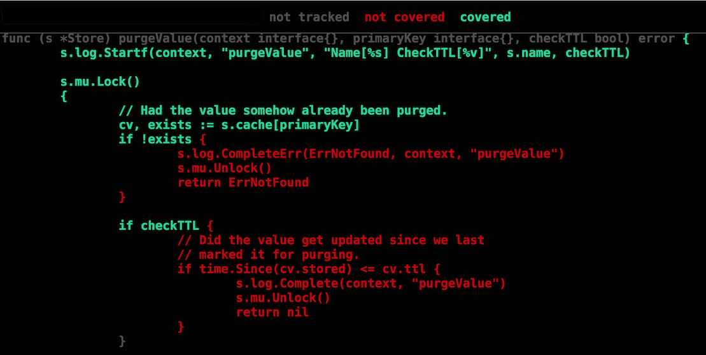

## Testing

테스팅은 go tool과 표준 라이브러리로 제공하고 있습니다. 테스팅은 프로젝트 개발 프로젝트의 시간을 엄청나게 줄여주기 때문에 개발 프로세스에서 중요한 부분입니다. 테스팅 기능과 함께 벤치마킹은 매우 강력한 도구입니다. 작성한 코드의 일부의 성능을 리뷰할 수 있습니다. 프로파일링은 함수 사이에 상호작용을 살펴보고 어떤 함수가 가장 많이 사용되는지 볼 수 있습니다.

## Notes

* Go에서 tool로 테스팅과 벤치마킹을 지원합니다.
* tool이 매우 유연해서 다양한 옵션을 줄 수 있습니다.
* 개발과 나란히 테스트를 작성합니다.
* 예제 코드는 테스트와 문서의 역할을 합니다.
* 개발, QA, 릴리즈 단계에서 벤치마킹을 할 수 있습니다.
* 성능 문제를 발견하면, 코드를 프로파일링해새ㅓ 어떤 함수에 집중되는지를 볼 수 있습니다.
* tool은 서로 영향을 줄 수 있습니다. 정밀한 메모리 프로파일링은 CPU 프로파일, goroutine blocking 프로파일링이 스케쥴러 trace에 영향을 미친다. 각 필요한 프로파일링 모드에 대해서 테스트를 재실행합니다.

## Links

http://golang.org/pkg/testing/  
http://dave.cheney.net/2013/06/30/how-to-write-benchmarks-in-go  
http://saml.rilspace.org/profiling-and-creating-call-graphs-for-go-programs-with-go-tool-pprof  
http://golang.org/pkg/net/http/pprof/  
https://software.intel.com/en-us/blogs/2014/05/10/debugging-performance-issues-in-go-programs  
https://github.com/dvyukov/go-fuzz  
https://talks.golang.org/2015/dynamic-tools.slide#1  
https://vimeo.com/141698770  
[Structuring Tests in Go](https://medium.com/@benbjohnson/structuring-tests-in-go-46ddee7a25c#.b2m3nziyb) - Ben Johnson  
[Advanced Testing Concepts for Go 1.7](https://speakerdeck.com/mpvl/advanced-testing-concepts-for-go-1-dot-7) - Marcel van Lohuizen  
[Parallelize your table-driven tests](http://golang.rakyll.org/parallelize-test-tables/) - rakyll  
[Advanced Testing with Go - Video](https://www.youtube.com/shared?ci=LARb45o5TpA) - Mitchell Hashimoto  
[Advanced Testing with Go - Deck](https://speakerdeck.com/mitchellh/advanced-testing-with-go) - Mitchell Hashimoto  
[The tragedy of 100% code coverage](http://labs.ig.com/code-coverage-100-percent-tragedy) - Daniel Lebrero's  

## Code Review

[Basic Unit Test](example1/example1_test.go) ([Go Playground](https://play.golang.org/p/bYkkr3uQcp))  
[Table Unit Test](example2/example2_test.go) ([Go Playground](https://play.golang.org/p/hhavdseEPj))  
[Mocking Web Server Response](example3/example3_test.go) ([Go Playground](https://play.golang.org/p/JJ_2VIL_R6))  
[Testing Internal Endpoints](example4/handlers/handlers_test.go) ([Go Playground](https://play.golang.org/p/HwuD-eNAOg))  
[Example Test](example4/handlers/handlers_example_test.go) ([Go Playground](https://play.golang.org/p/6V2J5gr7GC))  
[Sub Tests](example5/example5_test.go) ([Go Playground](https://play.golang.org/p/d4ZVYkZUGr))  

_Look at the profiling topic to learn more about using test to [profile](../profiling) code._

## Coverage

Making sure your tests cover as much of your code as possible is critical. Go's testing tool allows you to create a profile for the code that is executed during all the tests and see a visual of what is and is not covered.

	go test -coverprofile cover.out
	go tool cover -html=cover.out

___
All material is licensed under the [Apache License Version 2.0, January 2004](http://www.apache.org/licenses/LICENSE-2.0).
